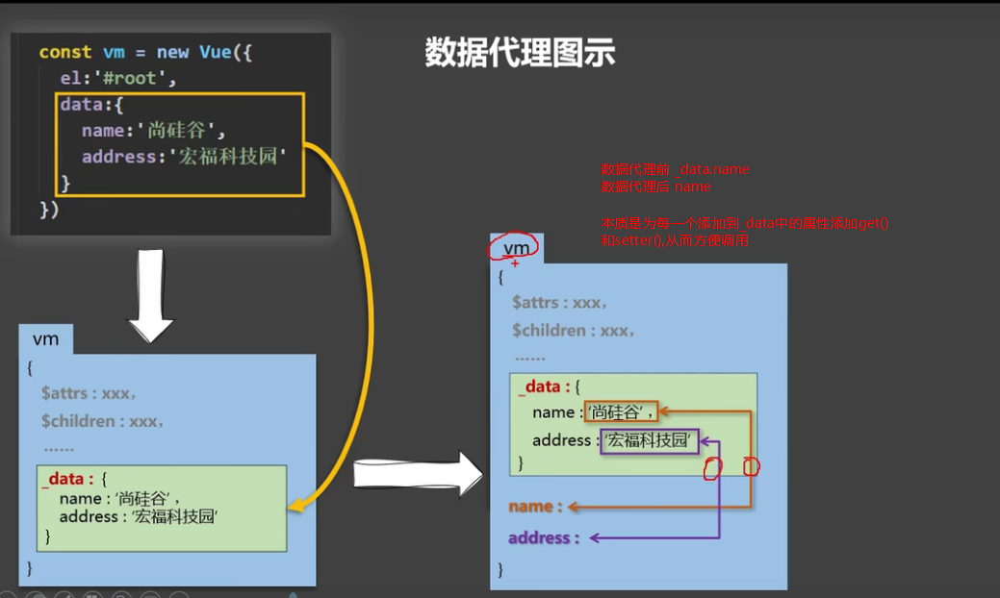

# Vue.js

### 1.vue的数据代理和响应式原理

```vue
页面-> vm.数据 ->vm._data
:数据代理 方便调用、编写数据

vm._data->vm.data
:数据劫持 利用数据劫持 使得数据被改变时页面发生变化（页面数据的响应式变化）
```

>
vue2的响应式结构核心为此方法的基础
>
---
### 2.v-cloak
```vue
直接用于元素上 如 <h1 v-cloak/>
[v-cloak]:{
	dispaly:none
}
```

> 在VM未生成，无法渲染解析元素时,不会操作。VM开始接管后，删除所有元素中的v-cloak，配合CSS的display：none，让因为网络等原因的无法渲染的元素隐藏，一旦VUE可以编译渲染元素，便让其展示。
>